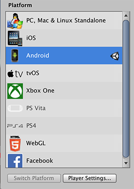
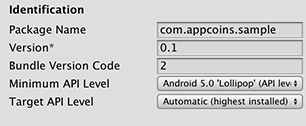
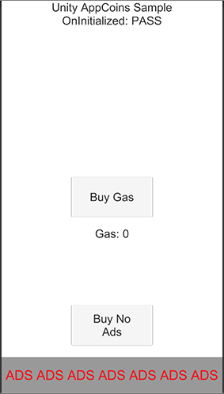
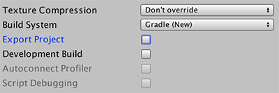
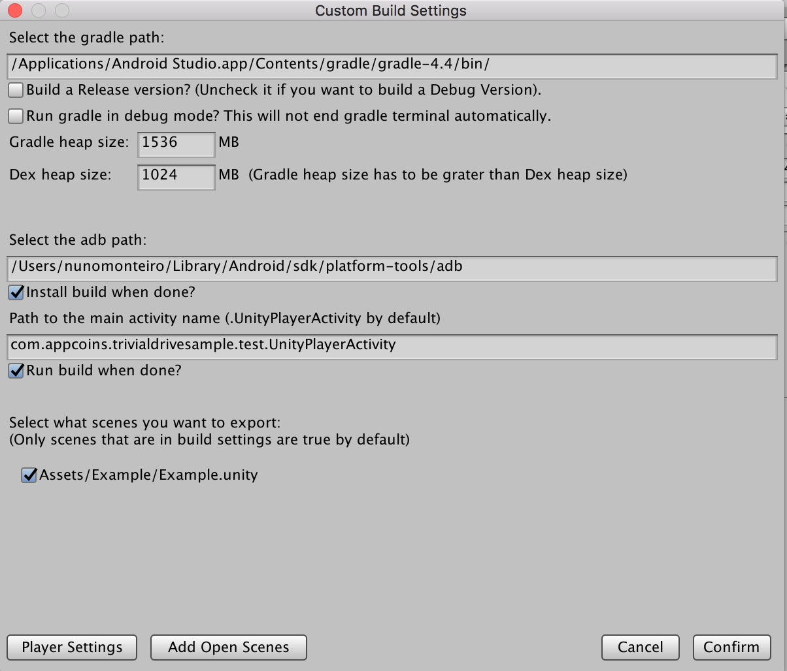
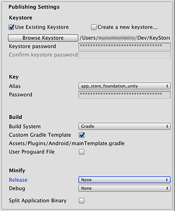
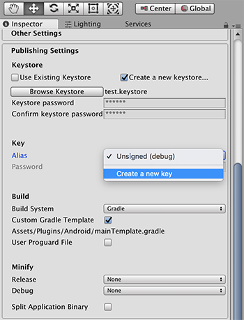
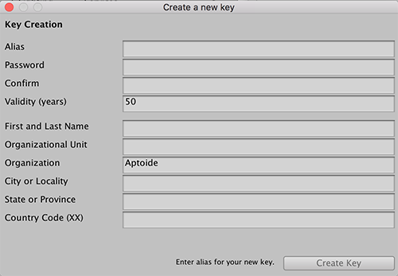

# AppCoins Unity Plugin


This is the official Unity plugin for the AppCoins Protocol that allows you to integrate AppCoins In-App Billing into your Unity Android game.

## About AppCoins Unity Plugin
This plugin is developed to support the  [AppCoins](https://appcoins.io/) protocol.
 Integrating this plugin allows developers to integrate the AppCoins In-App Billing into their game.

## Pre requisites to run the project
To successfully run the project you need to:
1. Download and install AppCoins Wallet app (you can get it on [Aptoide](https://appcoins-wallet.en.aptoide.com/?store-name=asf-store) or [GooglePlay](https://play.google.com/store/apps/details?id=com.appcoins.wallet))

2. Open AppCoins Wallet and create or restore a wallet

## Integrating the plugin into your game

1. Register on [BDS](https://blockchainds.com/)

2. Download the plugin package corresponding to your Unity version. You can find them on the latest release [here](https://github.com/Aptoide/bds-unity-plugin/releases).  Open the package in your Unity project (double click the file or in Unity go to Assets -> Import Package -> Custom Package.... and find the file you just downloaded). Make sure to import the example folder.

3. Open the example scene.

4. Make sure you are on the Android platform. Go to File -> Build Settings, select Android and then switch platform.



5. On the Build Settings screen click "Player Settings...". Change the package name to: "com.appcoins.sample"



6. Build and run for Android.

7. If everything goes well you should see the message:
"OnInitialized: PASS" on the top of the phone screen. This means that you have everything correctly setup. You can try the consumable and non-consumable purchases to also see that they work.

  **NOTE:** this will only work on the main network (Ethereum)



8. Insert these snippets into your logic class

9. Add these imports
```
        using Appcoins.Purchasing;
        using UnityEngine.Purchasing;
```

10. Define product ids
```
        public static string kYourProductID = "yourSkuID";
        public static string kOtherProductID = "otherSkuID";
```
11. Define outlet for Purchaser class
```
        [SerializeField]
        private Purchaser _purchaser;
```
12. Define OnPurchaseSuccess to process the purchase result
```
        private void OnPurchaseSuccess(AppcoinsProduct product)
        {
            Debug.Log("On purchase success called with product: \n skuID: " + product.skuID + " \n type: " + product.productType);

            if (product.skuID == kYourProductID) {
                GiveYourProduct();
            } else if(product.skuID == kOtherProductID) {
                GiveOtherProduct();
            }
        }
```
13. Setup purchaser with defined product ids and correct product types
```
        void SetupPurchaser() {
            _purchaser.onInitializeSuccess.AddListener(OnInitializeSuccess);
            _purchaser.onPurchaseSuccess.AddListener(OnPurchaseSuccess);

            _purchaser.AddProduct(kYourProductID, ProductType.Consumable);
            _purchaser.AddProduct(kOtherProductID, ProductType.NonConsumable);

            //Only call initialize after adding all products!
            _purchaser.InitializePurchasing();
       }
```
14. Call the function you just created when you want to initialize the Purchasing system. We want it as soon as possible so we add it to the Start method of our logic class.

```
        void Start () {
          //... your code ...
          SetupPurchaser();
        }
```

15. Create an instance of the prefab _AppcoinsPurchasing_ located on the Prefabs folder.

16. Fill it in with the appropriate values for _Developer Wallet Address_ and _Developer BDS Public Key_. (The default ones are working for the sample app)

17. Make sure to drag _AppcoinsPurchasing_ game object to the purchaser outlet your created in your logic object.

**NOTE:** If you want to easily debug the interactions with the BDS Purchasing system, you can attach a Unity.Text label to the Purchaser Status text outlet.

# Good practices you should follow

Disable purchase buttons if purchasing is not initialized yet.

Disable purchase buttons for already owned non-consumable buttons.

## Versioning
The priority of BDS and partners is to provide a good user experience to the user of Android apps and games.

BDS strongly recommends to use:
- Package ID: the same as in Google Play (e.g. “com.example.myapp”)
- Developer's signature: the same as in Google Play
- Vercode: higher than Google Play, by adding an extra digit - different than 0- in the left (e.g.: vercode Play=“573”, vercode BDS=“1573”)

To know more about this please check the [BDS FAQ](https://blockchainds.com/faq)

## To build the project

Go to the build menu (File -> Build Settings)
1. Check that the build system is set to "Gradle"
(if the import was done correctly this should've changed automatically).



Now click _Player Settings_.

On the _Player Settings_ window:

2. Click the other settings panel

3. Make sure you change the package name to your liking.

4. Make sure that you have min sdk version set to 21 (if the import was done correctly this should've changed automatically).

**Unity 2018.2b (and above)**

1. Connect the phone to your machine and click _Build and Run_

You should have your game running on the phone!

**Unity 2018.1.X and below (till Unity 5.6)**

1. Close the _Player Settings_ window

2. On the top bar click _AppCoins_

3. Click _Android Custom Build_

4. This popup will show up



5. The gradle path should be picked from the path to your Android Studio installation

6. Gradle and Dex heap size are just to be changed if you have issues building.

7. The adb path will be picked by you (assuming you have Android SDK installed)

8. Pick the scenes you want to include. The ones added to the build settings, as well as the scene you're currently added, will automatically be selected for you

9. When you click _Confirm_ a pop up will show up asking you to pick a folder to generate the _Android_ project to. Pick a folder of your liking preferably inside the project root (it can't be the project root itself).

  **NOTE:** The final build will be located here:
  FolderYouChoseToBuildTo/ProjectName/build/outputs/apk/
  in a subfolder called debug or release, depending on build settings)

10. When you pick the folder the build process will start. The normal build process will happen and then the custom build process will kick in opening a terminal window. Unity might seem to be not responding but worry not! This is normal because it's waiting for the terminal processes to finish.

11. If you ticked _Install build when done?_ make sure you have your phone connected to the computer and that you unlock it to allow ADB to install

12. If you ticked _Run build when done?_ make sure you have your phone connected to the computer and that you unlock it to allow ADB to run

13. The build process completed. You can run the app on your phone!

## To make a signed build
1. Go to Edit -> Project Settings -> Player

2. Open the Publishing Settings tab

If you already have a keystore:

3. Tick "Use Existing Keystore" and then click "Browse keystore" to fetch it.

4. You have to provide the keystore password to allow Unity to read the key aliases.

5. Pick the correct alias and provide its password as well

 

6. You're done!

If you don't have a key already:

7. Tick "Create new keystore..." and then click "Browse Keystore"

8. Now pick the path where the key will be created

9. Now pick a password and write it again to confirm

10. Click the alias dropdown and then chose "Create a new key"



11. Fill in all the details and click "Create Key"



12. Now go back to the alias dropdown and pick the alias you just created

13. You're done!

You're DONE! Congrats!
